# Sprint 4 - Spring Boot Tasca 2 - Nivell 1

API REST con Spring Boot utilizando persistencia con H2 y Spring Data JPA y Docker.

## Tecnologías utilizadas

- Java 21
- Spring Boot
- Spring Web
- Spring Data JPA
- H2 Database
- Jakarta Validation
- Maven
- JUnit 5
- Mockito
- MockMvc
- Docker
- IntelliJ IDEA
- Git
- GitHub

## Funcionalidades realizadas

API REST para gestionar frutas.

Funcionalidades implementadas:

- Crear frutas.
- Listar frutas.
- Buscar frutas por ID.
- Actualizar frutas.
- Eliminar frutas.
- Persistencia mediante H2 y Spring Data JPA.
- Validación de los datos de entrada.
- Uso de DTOs para las peticiones y respuestas.
- Gestión de errores cuando una fruta no existe.
- Gestión global de errores de validación.
- Respuestas en formato JSON.

## Arquitectura

Organizada por funcionalidad:

- **Controller**: gestiona las peticiones y respuestas HTTP.
- **Service**: contiene la lógica de negocio.
- **Repository**: gestiona el acceso a los datos mediante Spring Data JPA.
- **Model**: representa la entidad Fruit.
- **DTO**: controla los datos de entrada y salida de la API.
- **Exception**: contiene las excepciones y la gestión global de errores.

## Persistencia

Se utiliza una base de datos H2 en memoria.

La entidad `Fruit` se gestiona mediante JPA y `FruitRepository` extiende `JpaRepository`, permitiendo realizar las operaciones CRUD sin implementar manualmente el acceso a datos.

## Pruebas 

Comprobado de forma manual y automática.

### Pruebas manuales

PowerShell para comprobar:

- Creación de frutas
- Listado de frutas
- Actualización de frutas
- Eliminación de frutas
- Persistencia de los datos durante la ejecución de la aplicación
- Funcionamiento de la API ejecutándola dentro de un contenedor Docker

### Tests automáticos

- Tests del Service con Mockito.
- Tests de la capa web con MockMvc.
- Tests de validación.
- Tests de gestión de errores.
- Tests de integración con Spring Boot y H2.

## TDD

Se ha seguido TDD para las diferentes funcionalidades.

Primero he creado tests para definir el comportamiento esperado y posteriormente he implementado el código necesario para hacerlos pasar.

## Docker

La aplicación incluye un Dockerfile multi-stage.

La primera etapa utiliza el JDK de Java 21 para compilar la aplicación y generar el JAR.

La segunda etapa utiliza únicamente el JRE de Java 21 para ejecutar la aplicación, reduciendo las dependencias de la imagen final.

Para construir la imagen:

```bash
docker build -t fruit-api-h2 .
```

Para ejecutar el contenedor:

```bash
docker run --rm -p 8080:8080 fruit-api-h2
```

## Ejecución de la aplicación

- Desde IntelliJ IDEA.
- Mediante Maven.
- Ejecutando el JAR generado.
- Mediante Docker.
- Realizando peticiones a la API desde PowerShell.

### UML


### Pruebas de funcionamiento
```powershell
PS C:\Windows\system32> Invoke-RestMethod http://localhost:8080/fruits
PS C:\Windows\system32> Invoke-RestMethod `
>>   -Uri http://localhost:8080/fruits `
>>   -Method POST `
>>   -ContentType "application/json" `
>>   -Body '{"name":"Manzana","weightInKilos":1.5}'

id name    weightInKilos
-- ----    -------------
 1 Manzana           1,5


PS C:\Windows\system32> Invoke-RestMethod http://localhost:8080/fruits

id name    weightInKilos
-- ----    -------------
 1 Manzana           1,5


PS C:\Windows\system32> Invoke-RestMethod `
>>   -Uri http://localhost:8080/fruits/1 `
>>   -Method PUT `
>>   -ContentType "application/json" `
>>   -Body '{"name":"Pera","weightInKilos":2.3}'

id name weightInKilos
-- ---- -------------
 1 Pera           2,3


PS C:\Windows\system32> Invoke-RestMethod `
>>   -Uri http://localhost:8080/fruits/1 `
>>   -Method DELETE

PS C:\Windows\system32> Invoke-RestMethod http://localhost:8080/fruits
```

### Docker

```powershell
docker build -t fruit-api-h2 .
docker run --rm -p 8080:8080 fruit-api-h2
```

